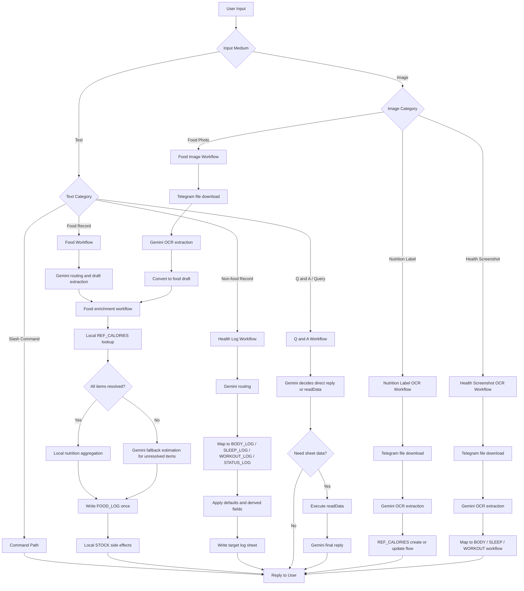

# HaijiSan

This project uses local TypeScript development for Google Apps Script and deploys compiled artifacts through clasp.

## Overview

HaijiSan is a Telegram bot project built on top of Google Apps Script.

The bot is already configured to receive Telegram messages through a webhook connected to Google Apps Script, and the Apps Script side is already connected to Google Sheets for data persistence. The spreadsheet foundation is already in place, so the current project focus is on improving the bot logic, expanding natural-language interactions, and adding AI-assisted features over time.

At the moment, the bot is intended to act as a lightweight personal logging assistant for body status, food tracking, inventory planning, and future nutrition estimation workflows.

## Current Runtime Setup

- Telegram bot messages are sent to a Google Apps Script web app through a webhook.
- Google Apps Script processes incoming messages and writes structured records into Google Sheets.
- The target spreadsheet is `Project_HAIJI`.
- The sheet structure is already created and ready for use.

## Spreadsheet Design

The spreadsheet is currently treated as an eight-tab structure. Canonical sheet names and column order are defined in `src/constants/sheets.ts` and `src/constants/sheet-layouts.json`, which remain the single source of truth for header generation and append order.

- `Status_Log`: simple status records such as bowel movement, menstrual status, symptoms, or medication notes.
- `Body_Log`: structured body metrics such as weight, BMI, body fat, and lean body mass.
- `Sleep_Log`: sleep sessions and summaries such as start time, end time, duration, and sleep quality.
- `Workout_Log`: structured workout records such as name, duration, heart-rate metrics, and calories burned.
- `Stock`: current inventory state for ingredients and household food items.
- `Food_Log`: top-level meal journal, one row per meal event.
- `Bot_Log`: bot processing trace for raw input, handling mode, result, and short notes.
- `Ref_Calories`: reusable calorie and macro reference data for foods, brands, and serving sizes.

## Project Structure

```text
.
├── gas/                        # Small GAS editor helpers kept outside the main src tree
├── docs/                       # Design notes and product/interaction documents
├── scripts/                    # Build, deploy, cleanup, and utility scripts
├── src/
│   ├── index.ts                # GAS webhook entrypoint and exported runtime functions
│   ├── commands.ts             # Slash-command and text command handling
│   ├── app-config.ts           # Runtime config injected at build time
│   ├── constants/              # Static command, AI, and sheet metadata
│   ├── handlers/               # User-input handlers for text and image messages
│   ├── services/               # OCR, Telegram, webhook, digest, and workflow services
│   ├── tables/                 # Schema-driven sheet access wrappers
│   ├── tools/                  # Tool registry and schemas used by AI workflows
│   ├── types/                  # Shared domain and transport types
│   ├── utils/                  # Small parsing, error, and logging helpers
│   └── shared/                 # Cross-feature date and record helpers
├── dist/                       # Build output used by clasp push
└── appsscript.json             # GAS manifest copied into dist during build
```

Notes:

- `handlers` should stay focused on input parsing, routing, and user-facing replies.
- `services` should hold reusable workflows and integrations without becoming sheet-specific.
- `tables` should stay close to spreadsheet row mapping and persistence concerns.
- `tools`, `types`, `utils`, and `shared` exist to keep feature code shorter and more explicit.

## Local Development

```bash
pnpm install
pnpm lint
pnpm typecheck
pnpm build
pnpm push
```

Create either `.env` or `.env.local` locally. Both files are ignored by [/.gitignore](.gitignore) and will not be committed to GitHub.

```env
SHEET_ID=your_google_sheet_id
BOT_TOKEN=your_telegram_bot_token
MY_CHAT_ID=your_chat_id
GEMINI_API_KEY=your_gemini_api_key
GEMINI_MODEL=optional_default_is_gemini_2_0_flash
GAS_SCRIPT_ID=your_google_apps_script_id
GAS_DEPLOYMENT_ID=optional_existing_deployment_id
```

Notes:

- `SHEET_ID`, `BOT_TOKEN`, `MY_CHAT_ID`, and `GEMINI_API_KEY` are injected into the final GAS artifact during `pnpm build`.
- `GAS_SCRIPT_ID` is used to generate `.clasp.json` when running `pnpm push` or `pnpm deploy`, so `.clasp.json` does not need to be committed.
- `GAS_DEPLOYMENT_ID` is only used by local `pnpm deploy`. If it is present, the existing deployment is updated; otherwise a new deployment is created.
- `GEMINI_MODEL` is optional locally and defaults to `gemini-2.0-flash`.

## GitHub Actions

Workflows:

- `.github/workflows/validate.yml`: Pull request validation running lint, typecheck, and build.
- `.github/workflows/deploy.yml`: On push to `main`, installs dependencies, validates, builds, runs `clasp push`, and creates or updates a deployment.

Configure these GitHub repository secrets:

- `CLASPRC_JSON`: The full contents of your local `~/.clasprc.json`.
- `SHEET_ID`: The production Google Sheet ID.
- `BOT_TOKEN`: The production Telegram bot token.
- `MY_CHAT_ID`: The allowed production chat ID.
- `GEMINI_API_KEY`: The production Gemini API key.
- `GAS_SCRIPT_ID`: The target Google Apps Script project ID used to generate `.clasp.json` in Actions.
- `GAS_DEPLOYMENT_ID`: Optional. If provided, the same web app deployment is updated continuously; otherwise a new deployment is created each time.

## Notes

`.clasp.json` is generated at runtime by local scripts and GitHub Actions, so it no longer needs to be committed. The generated config still uses `rootDir = dist`, which means the code pushed to GAS is always the compiled JavaScript output rather than the TypeScript source.

GitHub Actions cannot read your uncommitted local `.env` files, so cloud deployment must use GitHub Secrets or Variables instead of relying on local environment files.

## System Flow

The project now has a global routing shape that is broader than the current FOOD_LOG-only or OCR-only discussions. The diagram below is the intended end-to-end view of the whole bot runtime.



### Current Status

- Implemented:
  - Slash command handling
  - Text-based AI routing for direct reply, readData, insertData, and updateData
  - Non-food log writes for body, sleep, workout, and status records
  - FOOD_LOG dedicated workflow with local REF_CALORIES enrichment, multi-item draft splitting, and Gemini fallback estimation for unresolved items
  - Food-photo OCR conversion into FOOD_LOG drafts, with confirmation/review kept inside the Telegram flow when the write still needs user verification
  - FOOD_LOG stock side effects for safe direct stock matches
  - FOOD_LOG pending stock confirmation flow that records the meal first, then asks the user to confirm stock deduction separately
  - Direct stock-deduction quantity correction through Telegram reply input, including explicit examples and zero-to-cancel guidance
  - BOT_LOG audit logging
  - Telegram webhook idempotency protection
  - Generic OCR extraction service for nutrition labels, food photos, and health screenshots
  - Telegram image ingress for nutrition labels, food photos, and health screenshots
  - Nutrition-label OCR create-or-update flow for REF_CALORIES
- Planned next:
  - Better support for outside-food photos where a rough main-dish identification and calorie estimate is enough, without requiring a highly structured FOOD_LOG draft

## Feature List

- Natural-language logging across body status, sleep, workout, and meals instead of a command-heavy form workflow.
- OCR-first image ingestion for nutrition labels, food photos, and health screenshots inside the same Telegram chat flow.
- Reusable nutrition memory through `Ref_Calories`, so the system gets better as more foods and labels are logged.
- Diary-style `Food_Log`, keeping the main log readable while still supporting structured enrichment and follow-up processing.
- Inventory-aware meal logging, with stock side effects tied to food records instead of treating meal tracking and pantry tracking as separate tools.
- Lightweight confirmation and review paths for OCR-derived data, reducing silent bad writes while keeping the interaction in Telegram.
- Google Sheets as an inspectable source of truth, so raw logs, structured records, and bot traces stay visible without a separate app backend.
